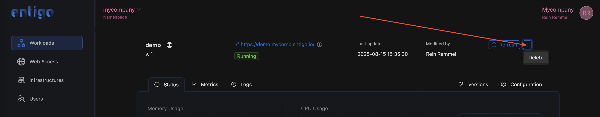
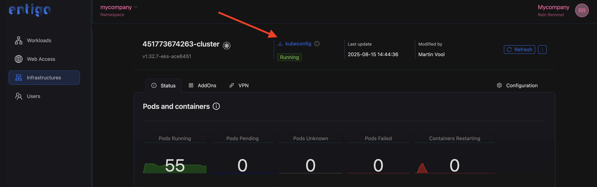
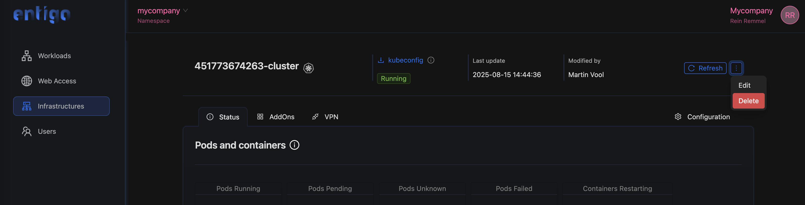
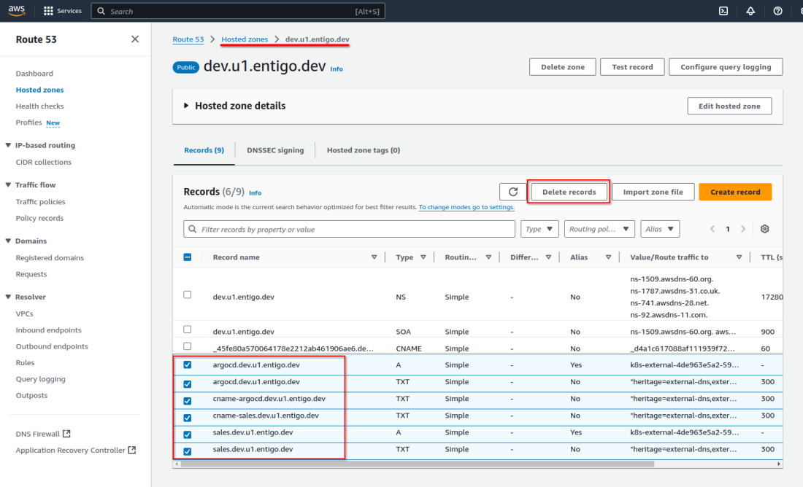
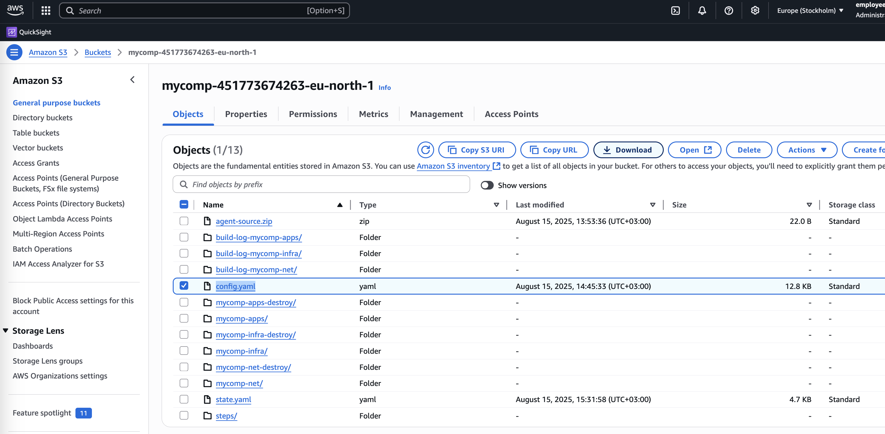

# Entigo Platform Account Cleanup HowTo

Clean up you Entigo Platform and AWS account.

## 1. Delete all applications and Web Access configurations

Through the web UI at https://app.entigo.com navigate to Webapps view and delete all deployed applications. 



Next, navigate to Web Access and delete all entries. 

## 2. Stop AWS resource management

These steps need to be executed in Kubernetes cluster. To connect to the cluster:
- Start a VPN connection (Wireguard)
- Download kubeconfig configuratio file
- If you don't have it yet, install ```kubectl``` CLI application
- Run cleanup commands
- Disconnect VPN

### Start a VPN connection

- Install a Wireguard VPN client: https://www.wireguard.com/install/. 
- Navigate to the VPN configuration page: ```Infrastructure -> VPN``` and download the VPN configuration: https://app.entigo.com/infrastructures/vpn
- Connect to the VPN. 

### Download kubeconfig

Navigate to the ```Infrastructure``` page and download the kubeconfig from the page header.



### Install kubectl and test connection to the cluster

If you don't have a kubectl CLI client installed, please follow the instructions: https://kubernetes.io/docs/tasks/tools/#kubectl

Open a terminal and navigate to the directory where you saved the ```kubeconfig.yaml``` file. Run the following command to verify that you can connect to the cluster:

```
export KUBECONFIG=./kubeconfig.yaml
kubectl cluster-info
```

This command will open a web browser and ask you to login with Entigo Platform credentials. After successful authentication, you should see something similar:

```
# kubectl cluster-info
Kubernetes control plane is running at https://0CCB53D9701C7531FE51D62F25EF2E34.gr7.eu-north-1.eks.amazonaws.com
CoreDNS is running at https://0CCB53D9701C7531FE51D62F25EF2E34.gr7.eu-north-1.eks.amazonaws.com/api/v1/namespaces/kube-system/services/kube-dns:dns/proxy

To further debug and diagnose cluster problems, use 'kubectl cluster-info dump'.
```

### Run cleanup commands

Since some AWS resources are created and managed by application that are part of Entigo Platform, these application have to be delete first, before you delete managed AWS resources. If the application is not deleted, it will recreate AWS resources. 

Delete Ingress object:
```
kubectl delete ingress -A --all
```

Delete External Secrets:
```
kubectl patch app external-secrets -n argocd -p '{"metadata": {"finalizers": ["resources-finalizer.argocd.argoproj.io"]}}' --type merge
kubectl delete app external-secrets -n argocd
kubectl delete ns external-secrets
```

Delete External DNS:
```
kubectl patch app external-dns -n argocd -p '{"metadata": {"finalizers": ["resources-finalizer.argocd.argoproj.io"]}}' --type merge
kubectl delete app external-dns -n argocd
kubectl delete ns external-dns
```

Delete AWS Application Load Balancer integration:
```
kubectl patch app aws-alb -n argocd -p '{"metadata": {"finalizers": ["resources-finalizer.argocd.argoproj.io"]}}' --type merge
kubectl delete app aws-alb -n argocd
kubectl delete ns aws-alb
```

After this step, you can disconnect the VPN. 

### Delete Entigo Platform infrastructure reference

Navigate to Infrastructure view and delete the cluster. 



## 3. Delete AWS Route 53 DNS records
Log in to the AWS Console and navigate to Route53 Zones view and for each zone and delete all the records except NS and SOA type in the newly created "...entigo.io" zone: https://console.aws.amazon.com/route53/v2/hostedzones



## 4. Delete Entigo Platform managed infrastructur resources

Through AWS Console navigate to IAM service and locate the user you used to log in to AWS. From the right click ```Create access key``` and export these in your terminal window:

```
export AWS_ACCESS_KEY_ID="copy key from AWS console"
export AWS_SECRET_ACCESS_KEY="copy secret form AWS console"
export AWS_REGION="eu-north-1" # region where you deployet the infrastructure, eu-north-1=Stockholm
```

Navigate to S3 service view in AWS Console and download Entigo Platform configuration file ```config.yaml```. Create a new empty directory and put the config file there. 

Open a terminal window and move to the directory where you saved the ```config.yaml``` file.




**NB! the directory where you run the following commands will be copied to the docker container. Please make sure that you are in a directory where only file is the config.yaml**

```
ls
```

Delete Infrastructure services
```
docker run -it --rm -v "$(pwd)":"/conf" -e AWS_ACCESS_KEY_ID -e AWS_SECRET_ACCESS_KEY -e AWS_REGION entigolabs/entigo-infralib-agent ei-agent destroy --yes --steps infra,net -c /conf/config.yaml
```

```
docker run -it --rm -v "$(pwd)":"/conf" -e AWS_ACCESS_KEY_ID -e AWS_SECRET_ACCESS_KEY -e AWS_REGION entigolabs/entigo-infralib-agent ei-agent delete --delete-bucket --delete-service-account -c /conf/config.yaml
```

Press "Y" to confirm the deletion.

That was it, everything is cleaned up!